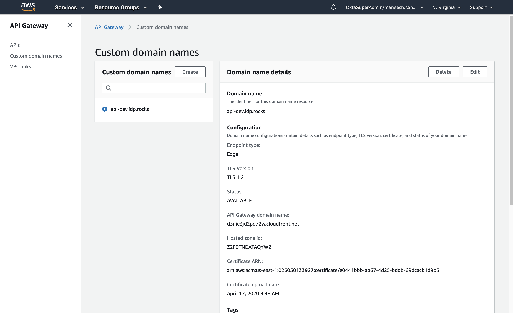

# DAC - Domains API

## Pre-requisites

- npm
- serverless
- aws account (create profile - udp-admin)
- java (to run dynamodb on local stack)

## Local Stack

Test your service locally, without having to deploy it first.

Install dependencies, installl dynamodb/local stack, start serverless-offline:

```bash
npm install
serverless dynamodb install
```

### Run service offline

Make sure to set `IS_OFFLINE` to `true`. If you don't set this environment variable, then lambda functions will attempt to use the dynamo DBs running in your AWS instance.

```bash
export IS_OFFLINE=true
serverless offline start
```

## AWS Stack

Create an AWS profile `udp-admin` on your computer.

If you want a custom-domain for your API endpoints configure in AWS API Gateway, edit `serverless.yml` and set the custom domain section.

The customDomain config ends up configuring `api-dev.idp.rocks` (for the dev stage). You can make it `api.<your domain>` or `anything.<your domain>` as you want it. Just make sure to 'Request a public certificate' in AWS Certificate Manager with the same domain name.
See this guide for more information: https://serverless.com/blog/serverless-api-gateway-domain/

```yml
customDomain:
  domainName: api-${self:provider.stage}.idp.rocks
  basePath: ""
  stage: ${self:provider.stage}
  createRoute53Record: false
```

Next, run

```bash
serverless create_domain
```

This will create a custom domain in your API Gateway.

This was created with the default setup:


Once the domain name is ready, run deploy to deploy the services (API Gateway, Lambda Functions, Authorizers, DynamoDB) in your AWS instance:

```bash
serverless deploy -v
```

```bash
...
Service Information
service: okta-domains
stage: dev
region: us-east-1
stack: okta-domains-dev
resources: 63
api keys:
  None
endpoints:
  POST - https://eynphk7c6h.execute-api.us-east-1.amazonaws.com/dev/domains
  GET - https://eynphk7c6h.execute-api.us-east-1.amazonaws.com/dev/domains/{domain}
  DELETE - https://eynphk7c6h.execute-api.us-east-1.amazonaws.com/dev/domains/{domain}
  GET - https://eynphk7c6h.execute-api.us-east-1.amazonaws.com/dev/domains
  GET - https://eynphk7c6h.execute-api.us-east-1.amazonaws.com/dev/.well-known/webfinger
  POST - https://eynphk7c6h.execute-api.us-east-1.amazonaws.com/dev/verifications
  PUT - https://eynphk7c6h.execute-api.us-east-1.amazonaws.com/dev/verifications/{domain}
  GET - https://eynphk7c6h.execute-api.us-east-1.amazonaws.com/dev/verifications/{domain}
  DELETE - https://eynphk7c6h.execute-api.us-east-1.amazonaws.com/dev/verifications/{domain}
functions:
  addDomain: okta-domains-dev-addDomain
  getDomain: okta-domains-dev-getDomain
  removeDomain: okta-domains-dev-removeDomain
  listDomains: okta-domains-dev-listDomains
  webfinger: okta-domains-dev-webfinger
  createVerification: okta-domains-dev-createVerification
  checkVerification: okta-domains-dev-checkVerification
  getVerification: okta-domains-dev-getVerification
  deleteVerification: okta-domains-dev-deleteVerification
layers:
  None

Serverless Domain Manager Summary
Distribution Domain Name
  Target Domain: d3nie3jd2pd72w.cloudfront.net
  Hosted Zone Id: Z2FDTNDATAQYW2
Serverless: Run the "serverless" command to setup monitoring, troubleshooting and testing.
```

Make Sure to create a DNS CNAME Alias for your custom domain to the Distribution Domain. In the case above, `api-dev.idp.rocks` --> `d3nie3jd2pd72w.cloudfront.net`

Once the DNS changes propagate, you can start using the API with your own domain.

## Usage

You can create, retrieve, update, or delete todos with the following commands:

### Create a Domain

```bash
curl -X POST -H "Content-Type:application/json" http://localhost:3000/domain --data '{ "domain": "boeing.com", "idp": "idp001" }'
```

Example Result:

```bash
{"domain":"boeing.com","idp":"idp001","created":1479138570824}
```

### List Domains for an Idp

```bash
curl -H "Content-Type:application/json" http://localhost:3000/domains?idp={idp}
```

Example output:

```bash
[{ "domain": "boeing.com", "idp": "idp001","created":1479138570824 }]
```

### Perform a Webfinger

```bash
# Replace the resource with an email address
curl -H "Content-Type:application/json" http://localhost:3000/.well-known/webfinger?resource={email}
```

Example Result:

```bash
{
    "subject": "pankaj@jepessen.com",
    "links": [
        {
            "rel": "okta:idp",
            "href": "/sso/idps/idp001",
            "titles": {
                "und": "MTASamlIdp"
            },
            "properties": {
                "okta:idp:metadata": "/api/v1/idps/idp001/metadata.xml",
                "okta:idp:type": "SAML2",
                "okta:idp:id": "idp001"
            }
        }
    ]
}
```

### Delete a Domain

```bash
# Replace the <id> part with a real id from your todos table
curl -X DELETE -H "Content-Type:application/json" http://localhost:3000/domains/{idp}/{domain}/
```

No output
